# SQMLite

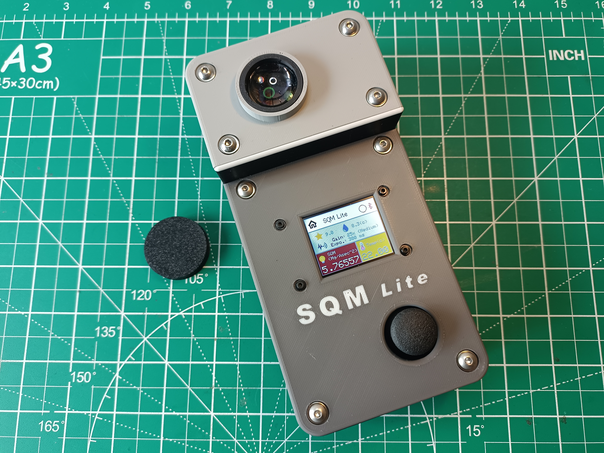

## Sommaire
- [Description](#description)
    - [Fonctionnalités](#fonctionnalités)
    - [Echelle de Bortle](#echelle-de-bortle)
- [Liste des pièces](#liste-des-pièces)
    - [Amazon](#amazon)
    - [Ali Express](#ali-express)
    - [Visserie & Divers](#visserie--divers)
- [Montage](#montage)
    - [Breadboard](#breadboard)
    - [PCB](#pcb)
    - [Boxes](#boxes)
    - [ESP32](#esp32)
    - [Capteurs](#capteurs)
    - [Optique du TSL2591](#optique-du-tsl2591)
- [Firmware](#firmware)
    - [Bibliothèques nécessaires à l'application](#bibliothèques-nécessaires-à-lapplication)
    - [Sélection de la carte](#sélection-de-la-carte)
    - [Paramètres de l'application dans Arduino IDE](#paramètres-de-lapplication-dans-arduino-ide)
    - [Configuration de l'application](#configuration-de-lapplication)
    - [Configuration de l'écran TFT ST7735](#configuration-de-lécran-tft-st7735)
    - [Implémentation](#implémentation)
    - [Mode \"Debug\"](#mode-debug)
- [Utilisation](#utilisation)
    - [Matériel](#matériel)
    - [Calibration](#calibration)
    - [Mise en veille](#mise-en-veille)
    - [Logiciel](#logiciel)
        - [En-tête](#en-tête)
        - [Ecran d'accueil](#ecran-daccueil)
        - [Ecran Luminosité](#ecran-luminosité)
        - [Ecran Environnement](#ecran-environnement)
- [Driver ASCOM](#driver-ascom)
    - [Installation](#installation)
    - [Détection du périphérique bluetooth dans Windows](#détection-du-périphérique-bluetooth-dans-windows)
    - [Utilisation dans NINA](#utilisation-dans-nina)
        - [Sélection du SQMLite dans NINA](#sélection-du-sqmlite-dans-nina)
        - [Première utilisation dans NINA](#première-utilisation-dans-nina)
- [Révisions](#révisions)

## Description
Le **SQM Lite** est un Sky Quality Meter (SQM) DIY (Do It Yourself) contenant les composants suivant :
- TSL2591
- BME280
- TFT ST7735

Ce modèle est basé sur le [**ROM V2**](https://github.com/Juani005999/ROMV2), sans le GPS, l'accéléromètre et la lecture de la température du ciel.

<a href="#sommaire">Retour au sommaire</a>

### Fonctionnalités

- Lecture de la luminosité (full / ir / visible), calcul de la quantité de Lux, du SQM et du Bortle.
- Lecture de la luminosité dans une tâche dédiée FreeRTOS s'exécutant en paralèlle sur le 2ème coeur de l'ESP 32.
- Correction thermique de la lecture du Lux en fonction de la température ambiante.
- Moyenne mobile du Lux sur 50 valeurs permettant de réduire l'incertitude mesurée. Calcul du SQM et du Bortle sur la moyenne mobile du Lux.
- Possibilité de remise à zéro de la moyenne mobile.
- Réglage automatique de la sensibilité (1x, 25x, 428x, 9876x) et de la durée de mesure (100ms, 200ms, 300ms, 400ms, 500ms, 600ms) du capteur de luminosité TSL2591.
- Lecture des conditions d'environnement (température, taux d'humidité, pression atmosphérique) via le capteur BME280.
- Calcul du point de rosée.
- Connection Bluetooth BLE.
- Driver ASCOM permettant de se connecter via Bluetooth BLE.
- Indicateur de mesure de luminosité en cours.
- Indicateur d'état d'une connection Bluetooth BLE client.
- Indicateur de charge restante dans la batterie.
- Mise en veille de l'écran après 5 minutes d'inactivité ou sur demande.

<a href="#sommaire">Retour au sommaire</a>

### Echelle de Bortle

Voici l'échelle de Bortle utilisée dans l'application.

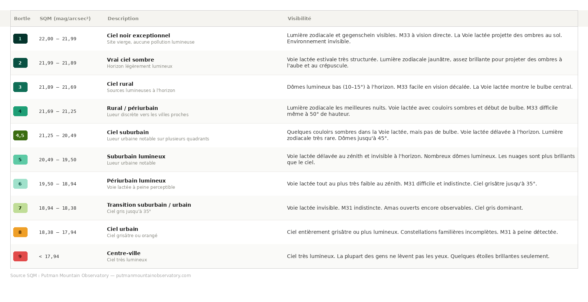

<a href="#sommaire">Retour au sommaire</a>

## Liste des pièces
### Amazon

| Composant | Prix | Nb. pièces | Prix unitaire |
| --- | --- | --- | --- |
| ESP32 with Battery (USB-C) | 18.77 € | 1 | 18.77 € |
| [TSL2591](https://www.amazon.fr/dp/B0GGD3FNKM) | 12.69 € | 1 | 12.69 € |
| [BME280](https://www.amazon.fr/dp/B07HMQMW6M) | 39.48 € | 5 | 7.90 € |
| [TFT ST7735](https://www.amazon.fr/AZDelivery-TFT-Compatible-Raspberry-incluant/dp/B07TJGF8HS) | 27.99 € | 5 | 5.60 € |
| [Lentille D23 F30](https://www.amazon.fr/Lentille-biconvexe-Double-Convexe-Optique/dp/B0GVHDZD22) | 25.94 € | 1 | 25.94 € |
| [Joystick](https://www.amazon.fr/Gebildet-Joystick-Commande-Contr%C3%B4leur-Raspberry/dp/B0DPMN19G6) | 10.99 € | 8 | 1.37 € |
| [Boot Button](https://www.amazon.fr/dp/B07S1MNB8C) | 10.99 € | 5 | 2.20 € |
| [Interrupteur à bascule](https://www.amazon.fr/dp/B076VKRKQQ) | 7.49 € | 5 | 1.50 € |
| [Rallonge USB-C](https://www.amazon.fr/Cablecc-3-1-type-femelle-donn%C3%A9es-dextension/dp/B075P2FF7L) | 17.56 € | 1 | 17.56 € |
| [Testeur de capacité](https://www.amazon.fr/dp/B0DKHT664R) | 12.79 € | 4 | 3.20 € |
| | | Total | **96.73 €** |

<a href="#sommaire">Retour au sommaire</a>

### Ali Express
| Composant | Prix | Nb. pièces | Prix unitaire |
| --- | --- | --- | --- |
| [ESP32 with Battery (USB-C)](https://fr.aliexpress.com/item/1005007579177706.html) | 5.09 € | 1 | 5.09 € |
| [TSL2591](https://fr.aliexpress.com/item/1005009222536594.html) | 3.79 € | 1 | 3.79 € |
| [BME280](https://fr.aliexpress.com/item/1005010256393146.html) | 4.59 € | 1 | 4.59 € |
| [TFT ST7735](https://fr.aliexpress.com/item/1005008974306385.html) | 3.29 € | 1 | 3.29 € |
| [Lentille D23 F30](https://fr.aliexpress.com/item/1005007033633969.html) | 2.33 € | 1 | 2.33 € |
| [Joystick](https://fr.aliexpress.com/item/1005009009852719.html) | 0.46 € | 1 | 0.46 € |
| [Boot Button](https://fr.aliexpress.com/item/1005007876916629.html) | 26.19 € | 20 | 1.31 € |
| [Interrupteur à bascule](https://fr.aliexpress.com/item/1005010311259797.html) | 1.79 € | 10 | 0.18 € |
| [Rallonge USB-C 0.2m](https://fr.aliexpress.com/item/1005005292730047.html) | 1.71 € | 1 | 1.71 € |
| [Testeur de capacité](https://fr.aliexpress.com/item/1005006350742151.html) | 1.45 € | 1 | 1.45 € |
| | | Total | **24.20 €** |

<a href="#sommaire">Retour au sommaire</a>

### Visserie & Divers

| Composant | Propriétés | Quantité |
| --- | --- | --- |
| Vis & rondelles | M4 x 20mm | 8 |
| Vis & rondelles | M2 x 20mm | 4 |
| Vis & rondelles | M2 x 8mm | 21 |
| Vis & rondelles | M2 x 6mm | 8 |
| Ecrou Nylstop autobloquants | M2 | 7 |
| [PCB EPLZON](https://www.amazon.fr/dp/B0B5DCHM7K) | ... | 1 |
| [Câbles Dupont](https://www.amazon.fr/Breadboard-Jumper-Wires-Dupont-Cable/dp/B0BTT48V7P) | ... | ... |
| [PCB Vis Connecteur](https://www.amazon.fr/dp/B082ZNRQMJ?th=1) | ... | ... |
| [Jumper Breadboard](https://www.amazon.fr/dp/B0F6LJS4L2?ref=ppx_yo2ov_dt_b_fed_asin_title) | ... | ... |
| [Pile Rechargeable 18650](https://bestpiles.fr/piles-rechargeables-18650/991-pile-rechargeable-18650-inr18650mj1-li-ion-37v-3500mah-10a-8438493099829.html) | Li-ion 3,7V 3500mAh 10A | 1 |

<a href="#sommaire">Retour au sommaire</a>

## Montage

<a href="#sommaire">Retour au sommaire</a>

### Breadboard
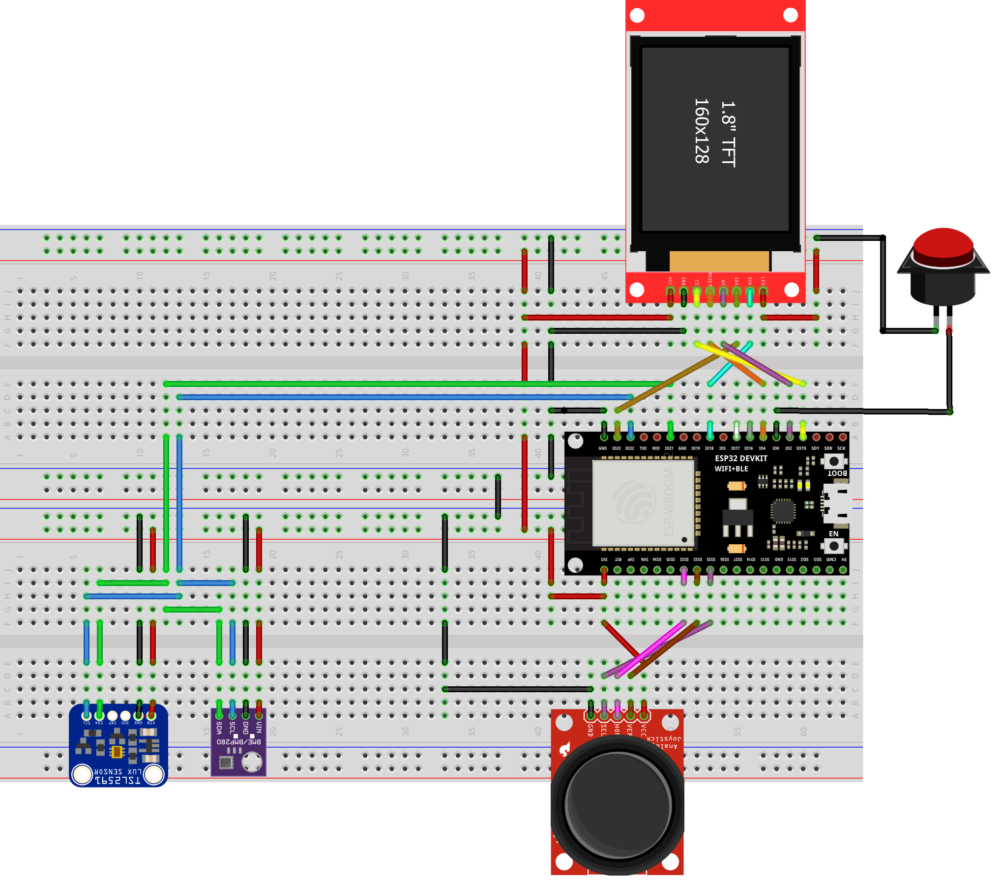

<a href="#sommaire">Retour au sommaire</a>

### PCB
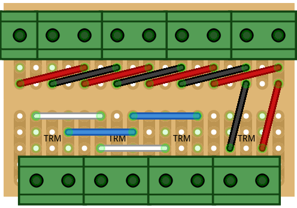
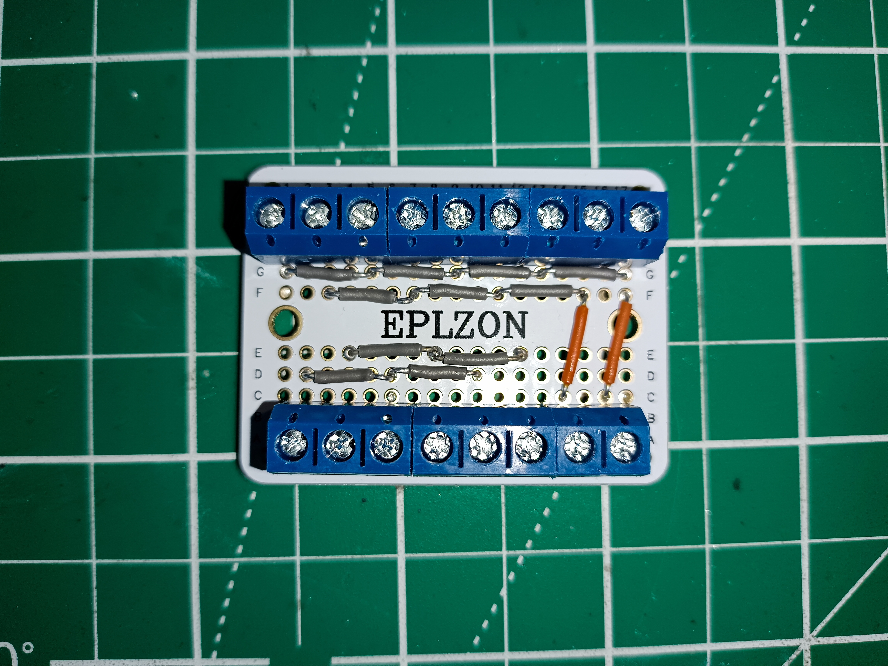

<a href="#sommaire">Retour au sommaire</a>

### Boxes
Vous trouverez dans [ce dossier](./Boxes/) tous les fichiers STL nécessaires à l'impression 3D.

<a href="#sommaire">Retour au sommaire</a>

### ESP32
Des branchements direct sur l'ESP32 sont nécessaires :
- 2 câbles Dupont branchés directement sur l'interrupteur de l'ESP et connectés à l'interrupteur du **SQM Lite**.
- 2 câbles branchés sur les pôles + et - de l'ESP et connectés à l'indicateur de charge restante de la batterie.

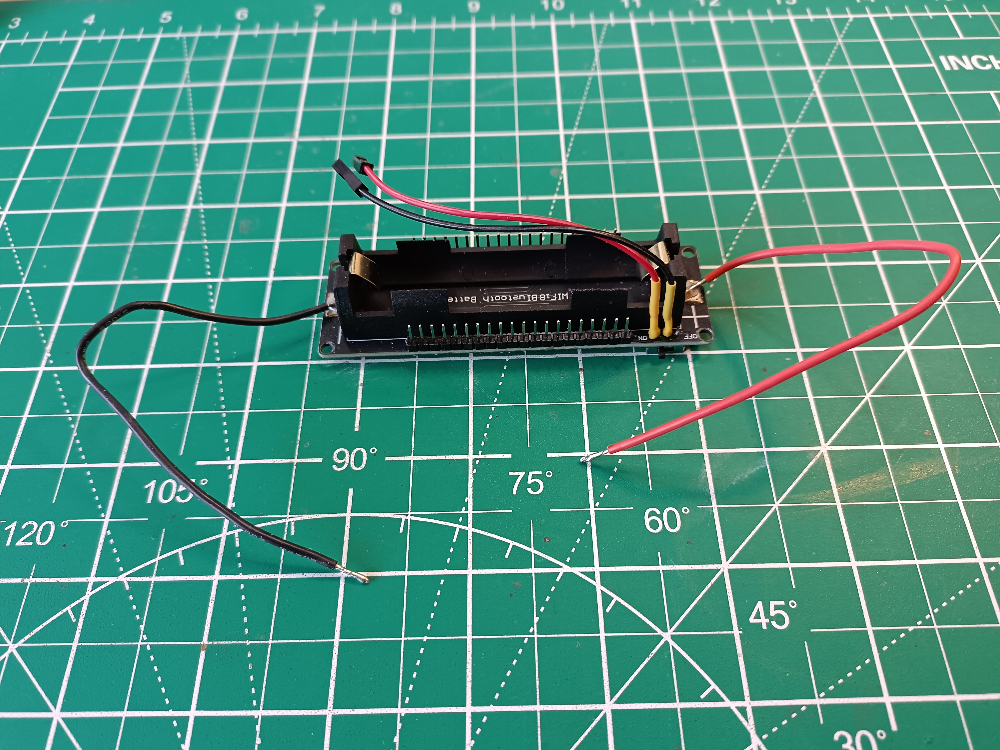

> [!WARNING]
> Attention, le connecteur **USB-C** présent sur l'ESP est **très très fragile** (j'en ai personnellement cassé plusieurs sur d'autres projets en faisant des branchements). Je vous conseil donc de rajouter 2 points de soudure de part et d'autre du connecteur  afin d'augmenter sa solidité.

<a href="#sommaire">Retour au sommaire</a>

### Capteurs
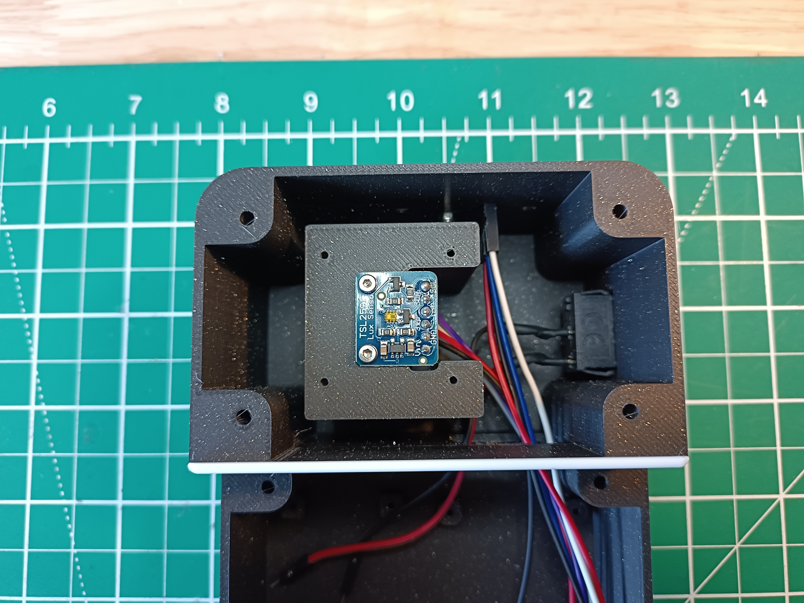
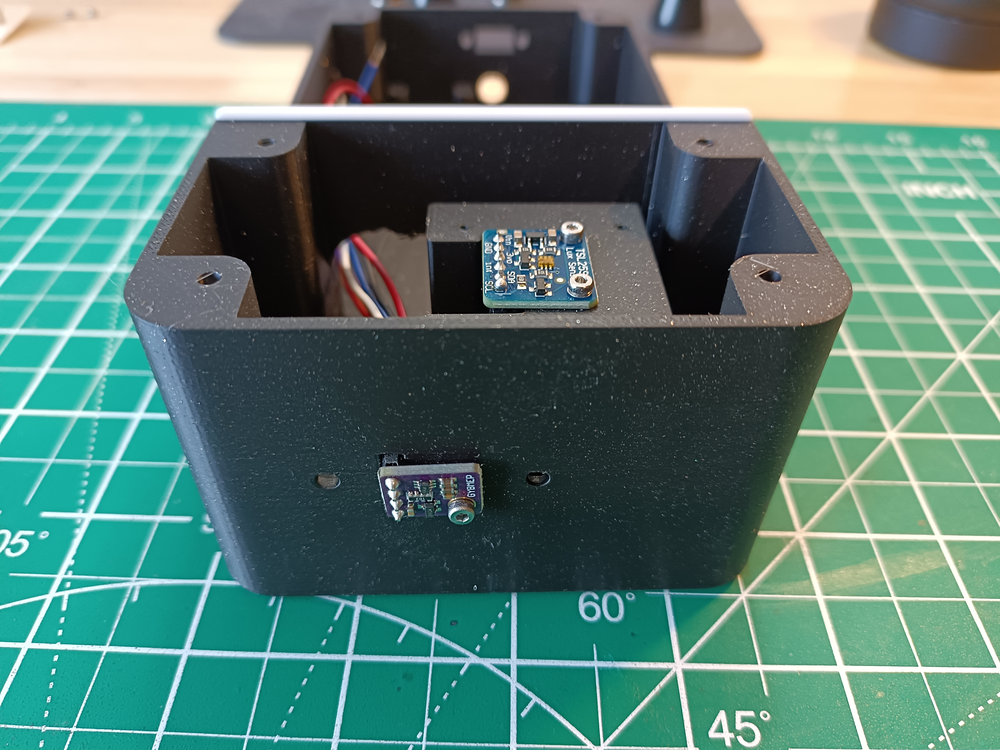
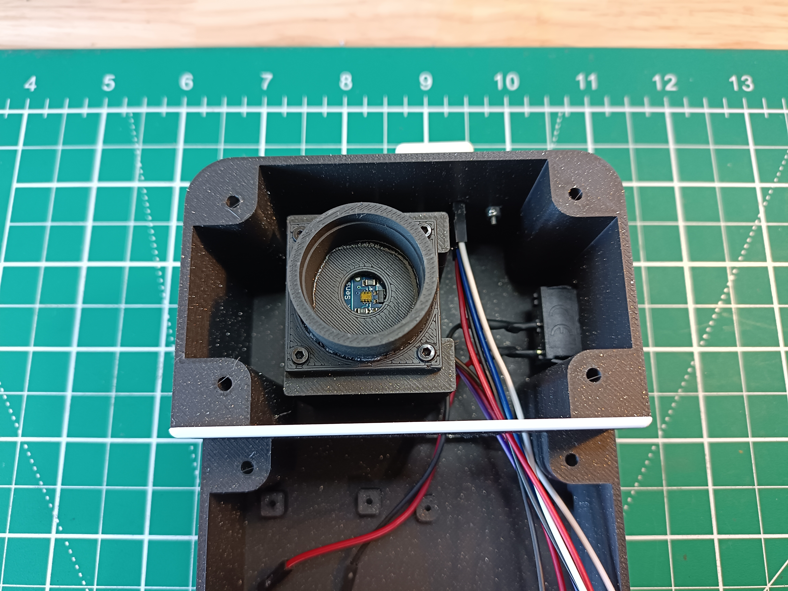
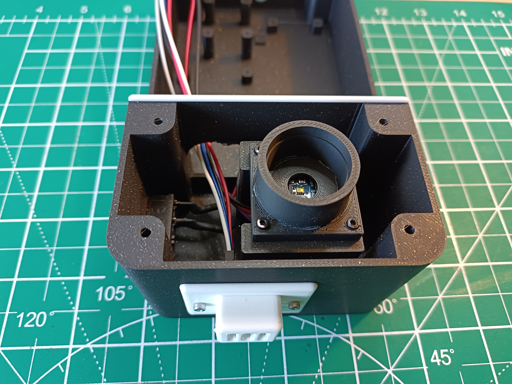

<a href="#sommaire">Retour au sommaire</a>

#### Optique du TSL2591
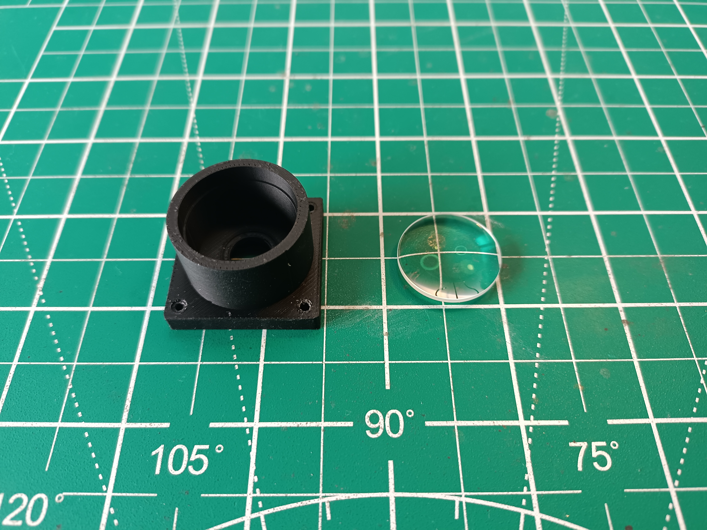
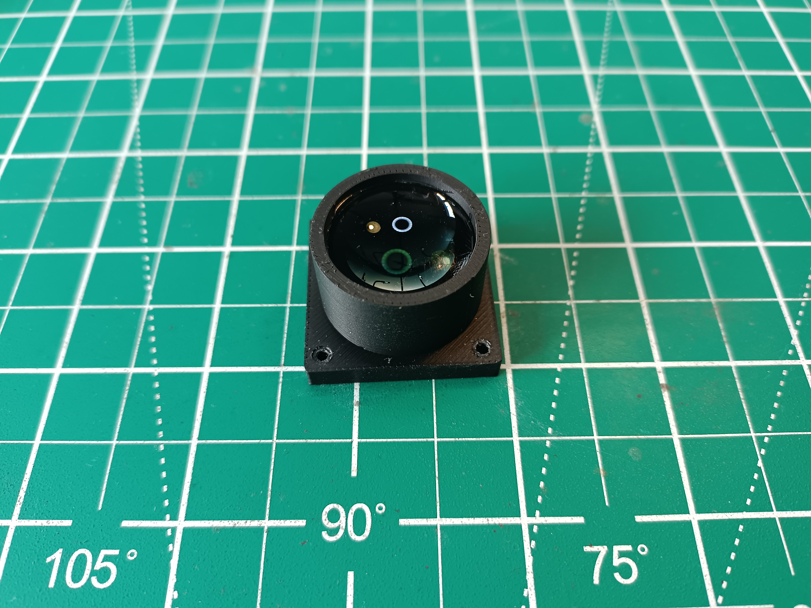
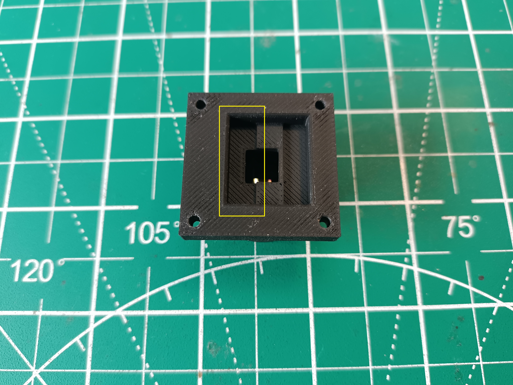

> [!IMPORTANT]
> La partie encadrée en jaune correspond au côté des vis du TSL2591.

> [!TIP]
> La lentille est optionnelle. Vous pouvez uniquement positionner le cache du capteur et le tube sans la lentille. Vous pourrez ensuite corriger la [calibration](#calibration) si nécessaire.

<a href="#sommaire">Retour au sommaire</a>

## Firmware

- Télécharger le fichier **SQMLite_Firmware.zip**
- Depuis votre Arduino IDE, installer la bibliothèque **SQMLite**, en sélectionnant le fichier téléchargé via le menu : \
***Croquis*** -> ***Importer une bibliothèque*** -> ***Ajouter la bibliothèque .ZIP ...***

<a href="#sommaire">Retour au sommaire</a>

### Bibliothèques nécessaires à l'application
Voici la liste des bibliothèques utilisées par l'application que vous devez installer via le gestionnaire de librairies dans votre *Arduino IDE* :

- Adafruit_TSL2591
- Adafruit_BME280
- TFT_eSPI

<a href="#sommaire">Retour au sommaire</a>

### Sélection de la carte
Dans votre *Arduino IDE*, sélectionnez la carte **ESP32 Dev Module**.
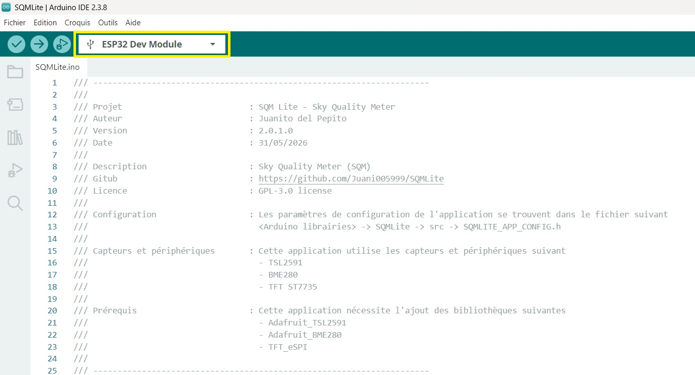

<a href="#sommaire">Retour au sommaire</a>

### Paramètres de l'application dans Arduino IDE

> [!WARNING]
> Attention : l'application nécessite de se positionner en mode **"Huge App"** (cf. image ci-dessous), permettant ainsi de disposer de l'espace mémoire suffisant pour le fonctionnement sur l'ESP32.

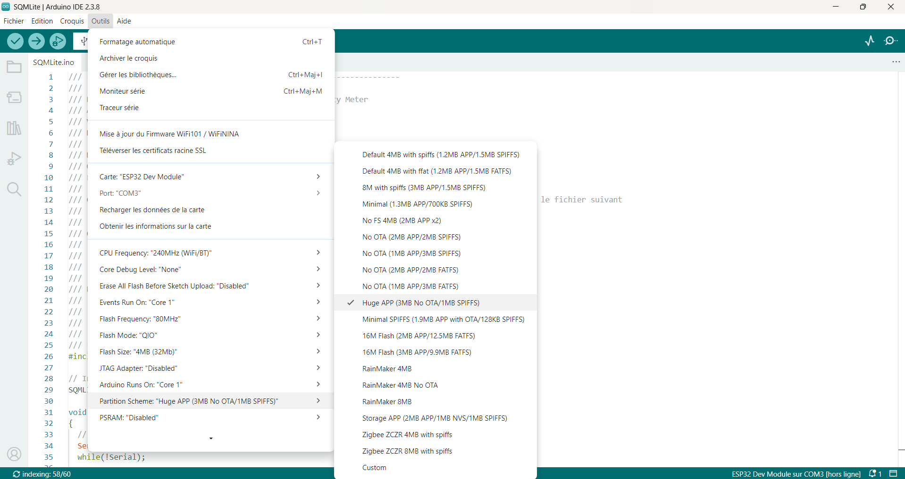

<a href="#sommaire">Retour au sommaire</a>

### Configuration de l'application
Vous pouvez accéder à la configuration de l'application via le fichier suivant : \
\<***Arduino librairies***\> -> ***SQMLite*** -> ***src*** -> ***SQMLITE_APP_CONFIG.h***

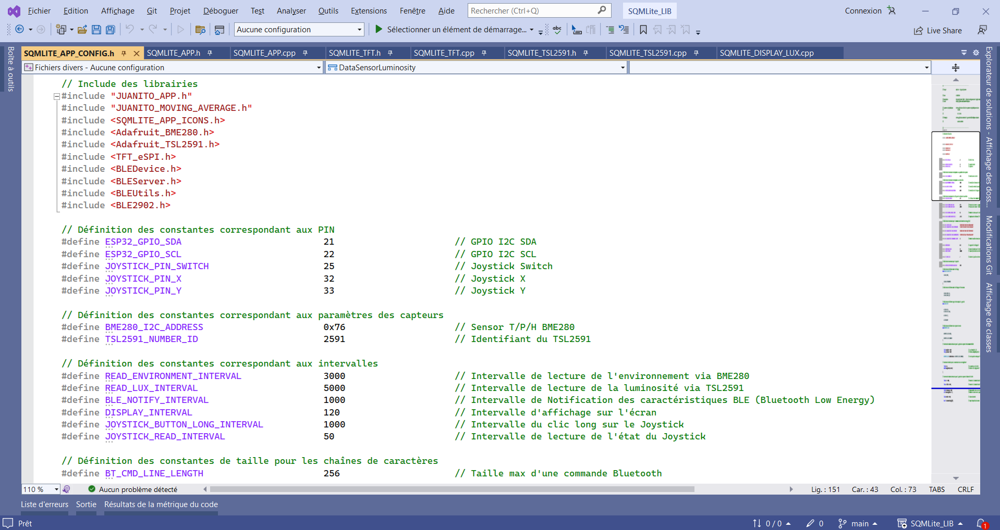

<a href="#sommaire">Retour au sommaire</a>

### Configuration de l'écran TFT ST7735
Afin de faire fonctionner votre écran, il vous sera nécessaire de le configurer via la bibliothèque **TFT_eSPI** en modifiant le fichier suivant : \
\<***Arduino librairies***\> -> ***TFT_sSPI*** -> ***User_Setup.h***

Vous devez modifier 2 paramètres :

- La sélection de votre écran :

- Les PINs associés à votre écran :
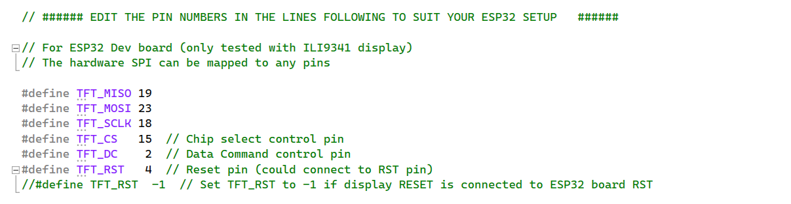

<a href="#sommaire">Retour au sommaire</a>

### Implémentation
Pour démarrer un nouveau projet SQMLite, il vous suffit d'aller dans les examples de votre Arduino IDE, et de sélectionner **SQMLite**.

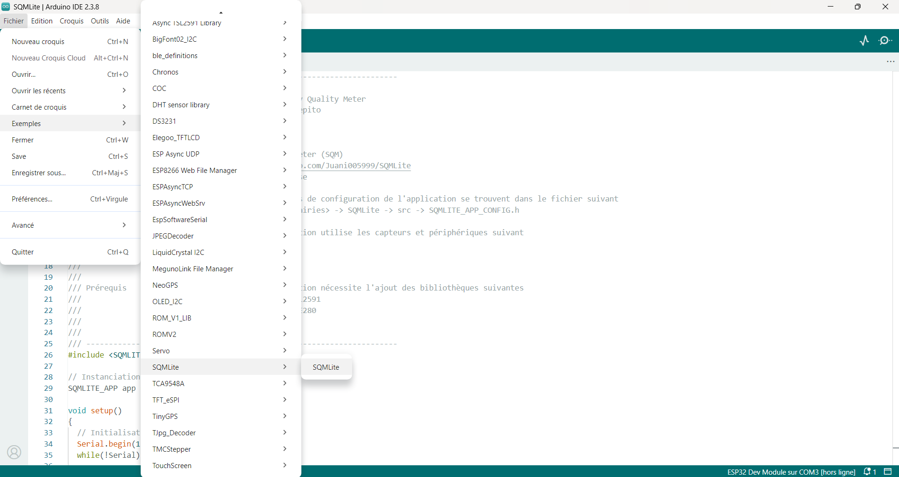

<a href="#sommaire">Retour au sommaire</a>

### Mode \"Debug\"
Pendant le développement de votre projet, vous pouvez activer le mode **Debug**.

> [!WARNING]
> Afin d'améliorer les performances, **n'oubliez pas de le désactiver une fois le fois le projet abouti**.

Dans le fichier suivant : \
\<***Arduino librairies***\> -> ***SQMLite*** -> ***src*** -> ***JUANITO_APP.h*** \
Enlevez les commentaires devant la ligne : \
`#define DEBUG`

En activant le mode **Debug**, vous pourrez voir les traces de l'application dans le *Moniteur série* de votre *Arduino IDE* pendant l'exécution. 

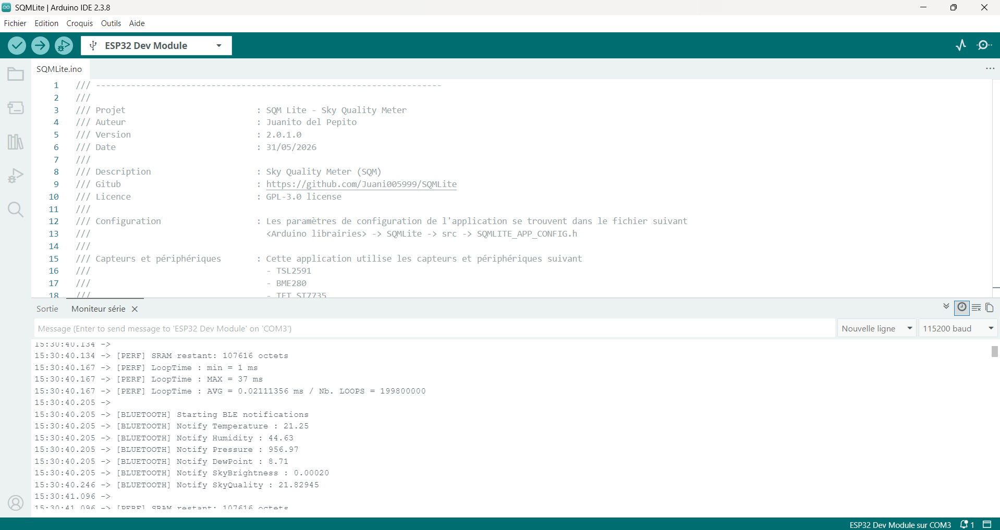

<a href="#sommaire">Retour au sommaire</a>

## Utilisation

### Matériel
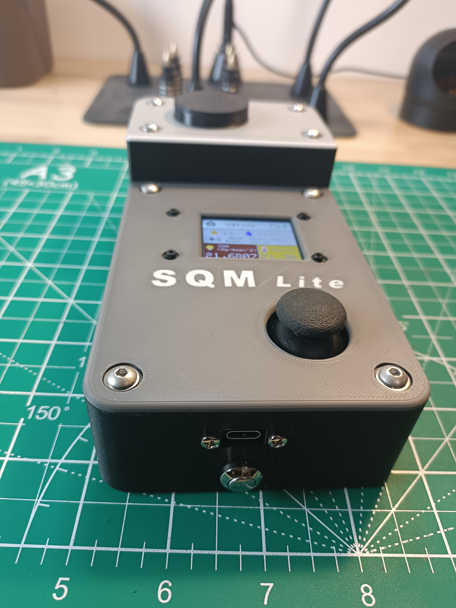
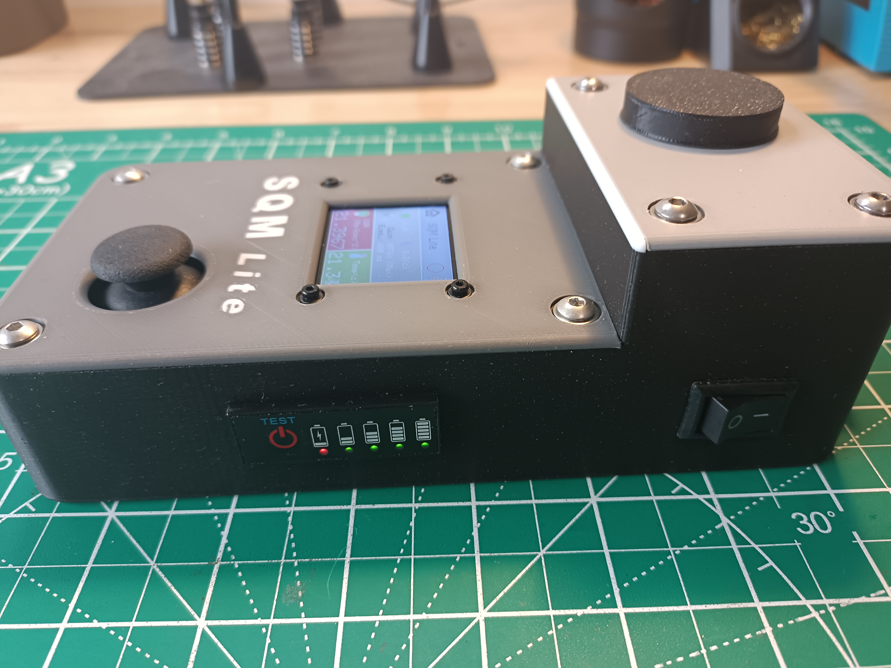

Vous trouverez au bas du **SQMLite** :
- 1 connecteur **USB-C** permettant de recharger le **SQMLite** et servant également à la mise à jour du firmware.
- 1 interrupteur (bouton poussoir) permettant de mettre l'ESP en mode Boot lors de la mise à jour du firmware.

Vous trouverez sur le côté droit du **SQMLite** :
- l'interrupteur On/Off de l'appareil.
- L'indicateur de charge restante dans la batterie. Appuyez sur le bouton **"TEST"** de l'indicateur pour connaître la charge restante.

Le pilotage du **SQMLite** s'effectue via le joystick :
- Droite et gauche permettent de naviguer parmis les différents écrans.
- Haut et Bas permettent un retour direct à l'écran d'accueil.
- Sur l'écran d'acceuil, un clic sur le joystick permet d'alterner l'affichage ***Lux*** et ***SQM***.
- Sur l'écran de luminosité, un clic sur le joystick permet de réinitialiser la moyenne mobile en cours.
- Un clic long sur le joystick permet de basculer l'écran en mode veille.

<a href="#sommaire">Retour au sommaire</a>

### Calibration

Dans le fichier de configuration, vous trouverez une constante définie permettant de calibrer le **SQMLite** dans sa lecture de luminosité via le TSL2591.
La constante de calibration est : `TSL2591_CALIBRATION`

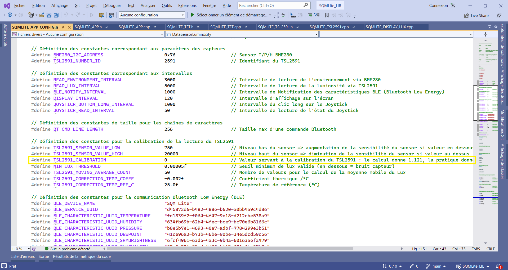

> [!TIP]
> La calibration nécessaire avec la lentille donne par le calcul une valeure de 1.121, mais dans la pratique, la valeure de 0 donne des résultats plus cohérents. Vous pouvez également donner des valeurs négatives si nécessaire.

<a href="#sommaire">Retour au sommaire</a>

### Mise en veille

L'écran du **SQMLite** s'éteint automatiquement après 5 min d'inactivité (modifiable dans le fichier de configuration).
Cette mise en veille peut être déclenchée à tout moment par un "click long" sur le joystick.

Pour sortir du mode veille, il suffit d'effectuer une action sur le joystick, peu importe laquelle.

<a href="#sommaire">Retour au sommaire</a>

### Logiciel

Le firmware est constitué de 3 écrans, avec un en-tête commun à tous les écrans.

#### En-tête

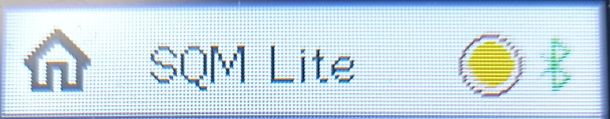

L'en-tête comprend les éléments suivants :
- Un icone principal spécifique à l'écran en cours d'affichage.
- Le titre de l'application.
- Un icone indiquant qu'une prise de mesure de la luminosité est en cours.
- Un icone indiquant la présence d'une connexion client via Blutooth (2 états : rouge et vert).

<a href="#sommaire">Retour au sommaire</a>

#### Ecran d'accueil

L'écran d'accueil comprend les éléments suivants :
- Un icone affichant la valeur de Bortle en cours.
- Un icone représentant le point de rosée ainsi que la température du point de rosée. L'icone à trois états :
    - Bleu : pas de risque de buée.
    - Orange : point de rosée à moins de 5°c de la température ambiante, risque de buée imminente.
    - Rouge : point de rosée atteint, pare-buée obligatoire.
- Le gain du capteur lors de la dernière mesure de luminosité effectuée.
- Le temps d'exposition du capteur lors de la dernière mesure de luminosité effectuée.
- Un espace affichant la valeur de luminosité mesurée. Deux modes d'affichage :
    - Affichage du Lux
    - Affichage du SQM (Mag / Arcsec²).\
> [!TIP]
> On passe d'un mode à l'autre (Lux / SQM) en cliquant sur le joystick.
- Un espace affichant la valeur de la température ambiante.

<a href="#sommaire">Retour au sommaire</a>

#### Ecran Luminosité

L'écran Luminosité comprend les éléments suivants :
- La luminosité mesurée totale et dans les Infrarouge.
- La luminosité mesurée dans le visible.
- La quantité de Lux issue des mesures Ir et Full.
- La quantité de Lux sur une moyenne mobile. Le nombre de mesures permettant de calculer la moyenne est entre parenthèse. Le nombre maximum de valeurs pour le calcul de la moyenne mobile est de 50 (ce nombre est modifiable dans le fichier de configuration via la constante `TSL2591_MOVING_AVERAGE_COUNT`).
- Le SQM (Mag / Arcsec²) calculé à partir du Lux moyen.
- Le Bortle issu de la valeur du SQM calculé.
- Le gain du capteur lors de la dernière mesure de luminosité effectuée.
- Le temps d'exposition du capteur lors de la dernière mesure de luminosité effectuée.

> [!NOTE]
> Le gain et le temps d'exposition du capteur sont ajustés automatiquement par le firmware afin d'avoir les valeurs les plus appropriées en fonction du contexte.

> [!IMPORTANT]
> Pour réinitialiser la moyenne mobile effectuée sur la mesure de Lux, il suffit d'effectuer un **clic sur le joystick**.

<a href="#sommaire">Retour au sommaire</a>

#### Ecran Environnement

L'écran Environnement comprend les éléments suivants :
- La température ambiante (°C).
- Le taux d'humidité (%).
- La pression atmosphérique (Pa).
- Un icone représentant le point de rosée ainsi que la température du point de rosée. L'icone à trois états :
    - Bleu : pas de risque de buée.
    - Orange : point de rosée à moins de 5°c de la température ambiante, risque de buée imminente.
    - Rouge : point de rosée atteint, pare-buée obligatoire.

<a href="#sommaire">Retour au sommaire</a>

## Driver ASCOM

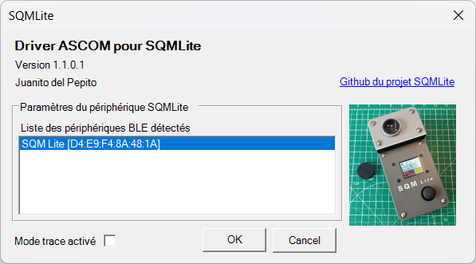

### Installation

- Téléchargez et exécutez le fichier **ASCOM driver for SQMLite setup.exe**

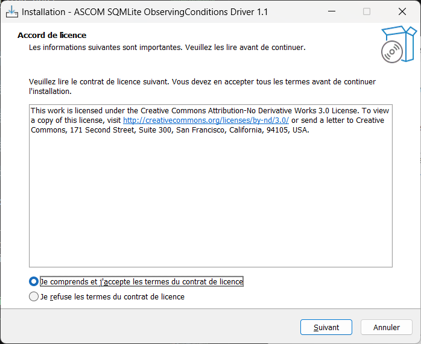

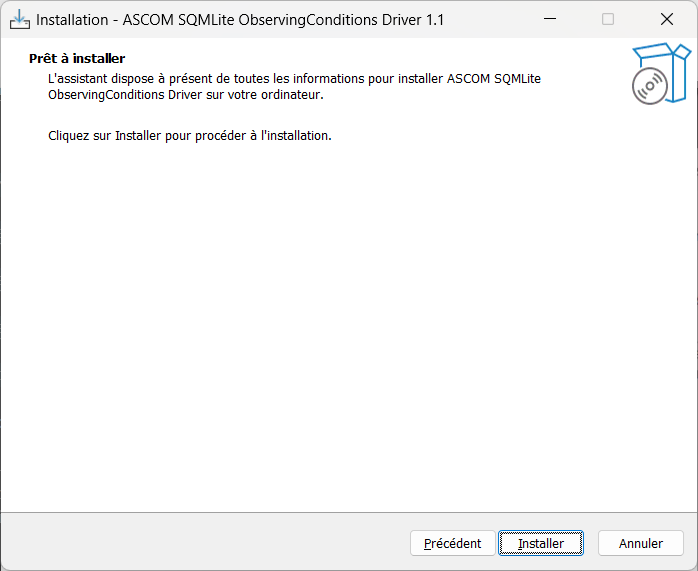

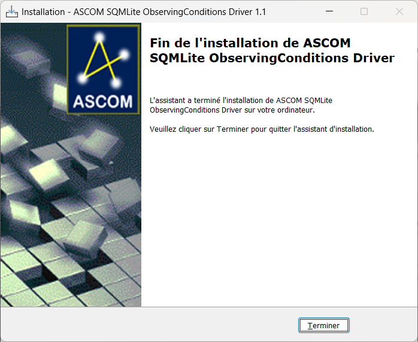

<a href="#sommaire">Retour au sommaire</a>

### Détection du périphérique bluetooth dans Windows

Afin de pouvoir utiliser le **Driver ASCOM SQMLite** depuis votre application Astro comme N.I.N.A., vous devez au préalable déclarer votre périphérique Bluetooth auprès de votre système Windows.

> [!IMPORTANT]
> Cette opération de reconnaissance de votre périphérique Bluetooth auprès de votre système Windows n'est à faire qu'une seule fois, lors de la première utilisation.

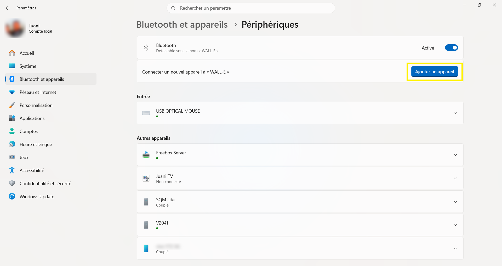

Dans la fenêtre des paramètres windows, allez dans la section "***Bluetooth et appareils***", si nécessaire, cliquez sur "***Afficher d'autres périphériques***", puis cliquez sur le bouton "***Ajouter un appareil***" et suivez les étapes de l'assistant.

<a href="#sommaire">Retour au sommaire</a>

### Utilisation dans NINA

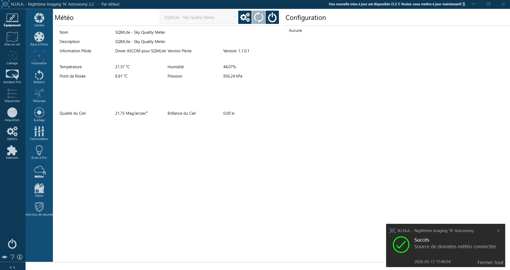

#### Sélection du SQMLite dans NINA

Afin de sélectionner le **SQMLite** dans N.I.N.A., allez dans l'onglet "***Equipements***", et dans le sous-onglet "***Météo***".\
Dans la liste déroulante, sélectionnez "***SQMLite - Sky Quality Meter***"

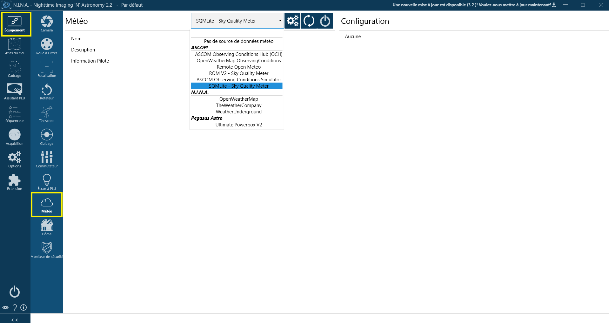

<a href="#sommaire">Retour au sommaire</a>

#### Première utilisation dans NINA

Lors de la première utilisation dans N.I.N.A., un appairage du **SQMLite** est nécessaire.\
Pour cela, cliquez sur le bouton "***Paramètres***".

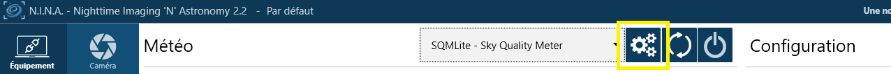

Dans la boîte de dialogue qui s'ouvre, sélectionnez le périphérique "***SQM Lite***" détecté puis validez.

> [!NOTE]
> Voilà, l'appairage est effectué. Il ne sera plus nécessaire d'effectuer cette opération lors des prochaines utilisations.

<a href="#sommaire">Retour au sommaire</a>

Voilà, vous pouvez désormais profiter des données du **SQMLite - Sky Quality Meter** dans NINA.\
Enjoy

<b><i>Juanito del Pepito</i></b>

## Retex

Voici un petit retour d'expérience des mesures de l'état de mon ciel à mon domicile :

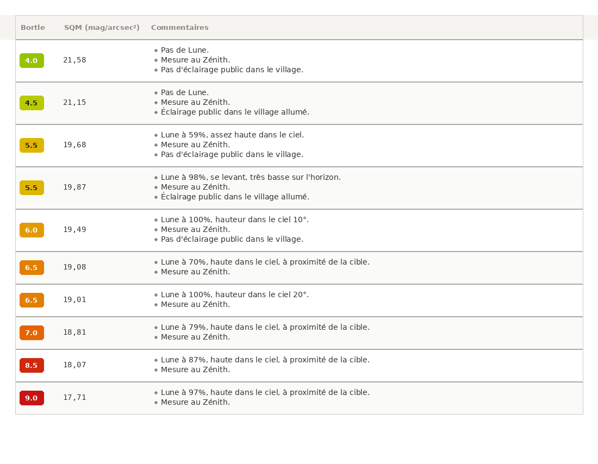

## Révisions

| Date | Version | Commentaires |
| --- | --- | --- |
| 31/05/2026 | 2.0.1.0 | Version initiale |

<a href="#sommaire">Retour au sommaire</a>

